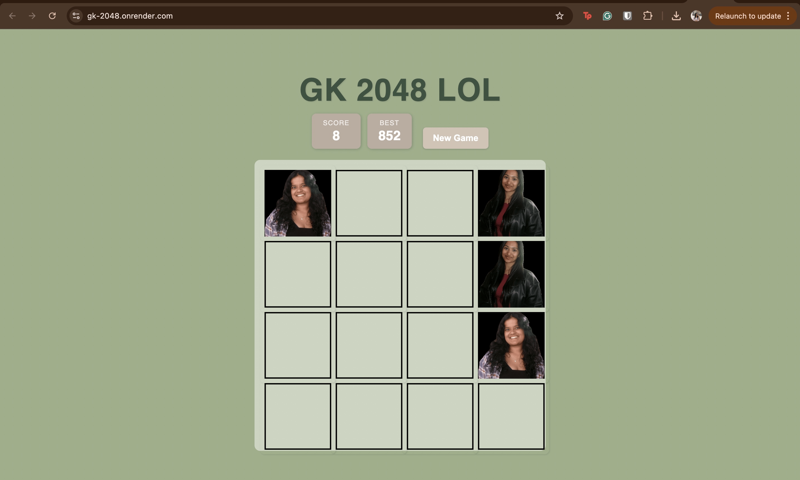
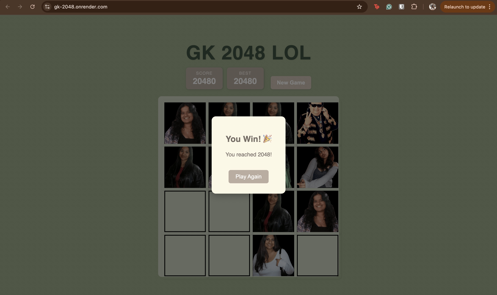
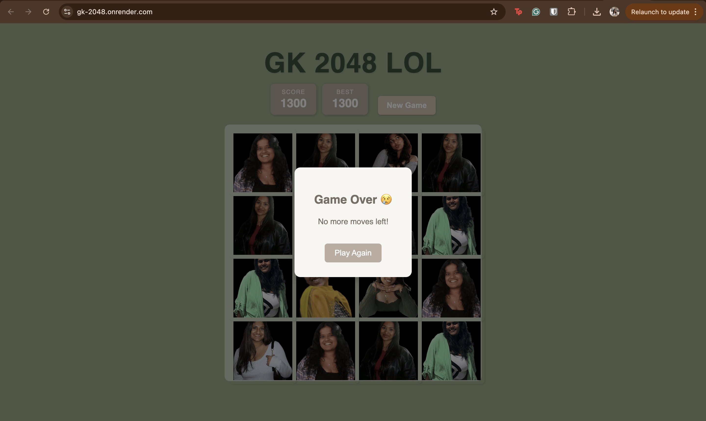

# GK 2048 – A Personalized Twist on the Classic Game

A custom version of the iconic 2048 game built with **Flask** and **JavaScript**, featuring unique face-tile images instead of numbers and a polished, responsive interface.

##  Features
- Classic 2048 logic with arrow key movement
- Custom images for each tile (e.g., `face_0.png` = 2, `face_1.png` = 4, etc.)
- Real-time score + persistent best score via `localStorage`
- "Game Over" + "You Win (2048 reached)" modal popups
- Reset/New Game button
- Tile-merging animation and responsive UI
- Flask-powered backend + lightweight REST API

## Tech Stack
- **Frontend**: HTML, CSS, JavaScript
- **Backend**: Python, Flask
- **Images**: Static `/static/images/face_*.png`
- **Deployment**: [Render]https://gk-2048.onrender.com/

## Screenshots
| Gameplay | Victory Modal | Game Over |
|---------|----------------|------------|
|  |  |  |

## 📂 Project Structure
- app.py #flask backend
- game2048.py #core game logic class
- templates/
  - index.html #main html file
- static/
  - images #face tile images
 
## Running Locally

1. Clone the repository
git clone https://github.com/mmedha04/gk-2048.git
cd gk-2048

2. (Optional) Create a virtual environment
python -m venv venv
source venv/bin/activate  # Mac/Linux
venv\Scripts\activate     # Windows

3. Install dependencies
pip install flask

4. Run the app
python3 app.py

5. Open in browser
http://localhost:5000

## What I Learned
- Writing interactive frontends with vanilla JS
- Structuring REST API routes with Flask
- Managing game state across client/server
- Debugging tile merge logic and handling win/lose conditions

## Acknowledgements
Inspired by the original 2048 game, this project was created to explore full-stack development and add a fun, personalized twist that includes the faces of my friends and idols.
  

